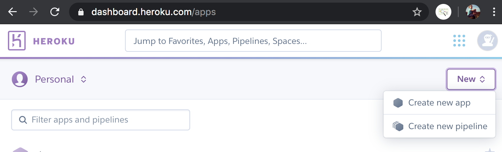
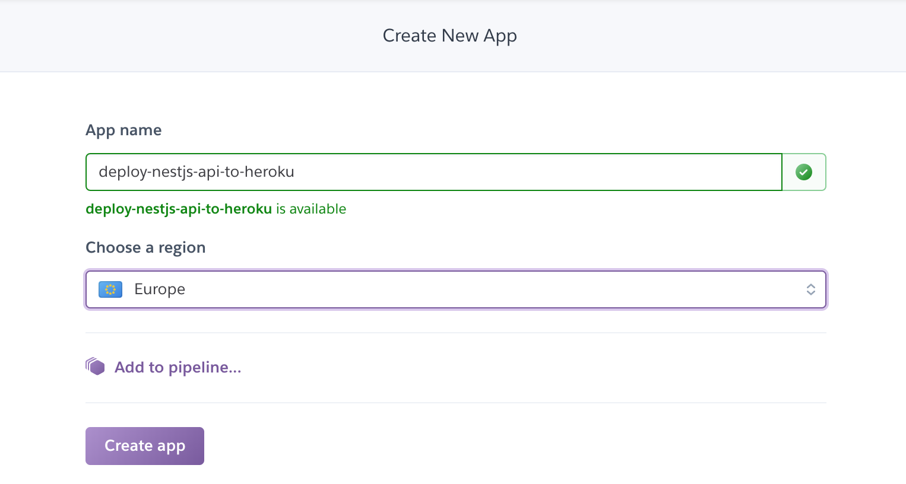
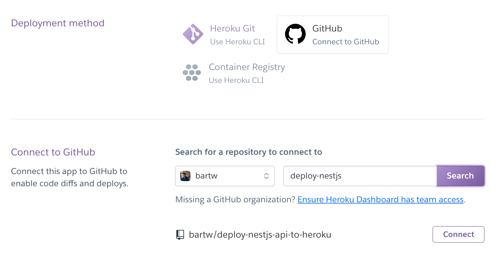
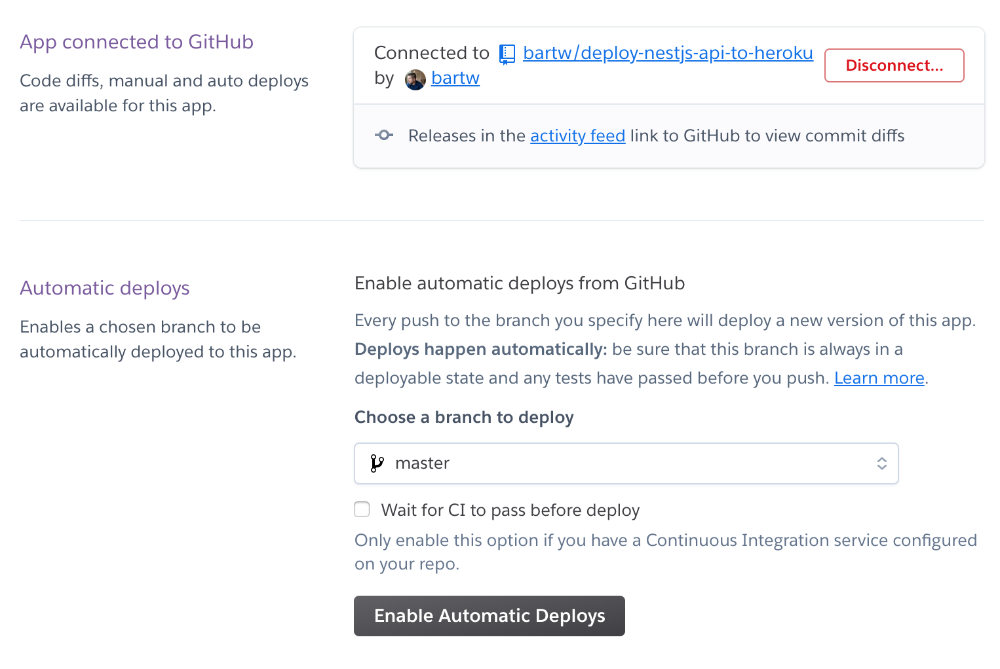
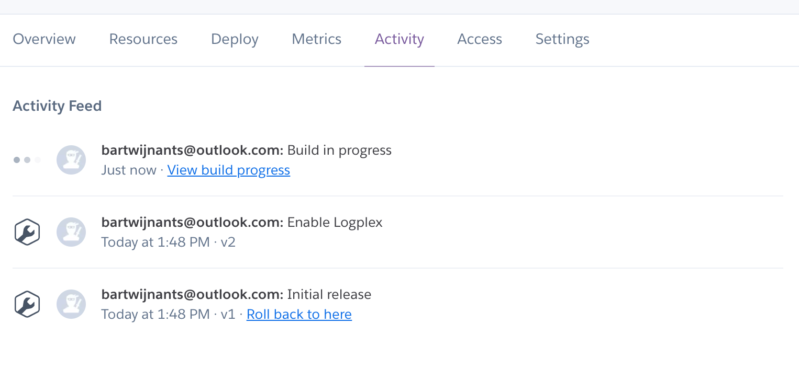

As I wrote in the previous post, there is still some work involved to get my Nest api deployed.

In this post I'm going to put in that work.

The code in this post continues where the [code](https://github.com/bartw/nestjs-from-scratch) from the previous post stopped.

I'll deploy my api to [Heroku](https://www.heroku.com/home). The main reason for Heroku is that it is free. And I might use their free [PostgreSQL](https://elements.heroku.com/addons/heroku-postgresql) addon in the future too.

I'm going to start with using the correct port. For local development port 3000 (or anything else) was ok. But when I deploy to Heroku, they want to be in charge of the port. I can just get it from the `PORT` env variable.

`main.ts`

```js
import { NestFactory } from "@nestjs/core";
import { AppModule } from "./app.module";

async function bootstrap() {
  const app = await NestFactory.create(AppModule);
  // highlight-next-line
  await app.listen(process.env.PORT || 3000);
}
bootstrap();
```

[RxJS](https://rxjs-dev.firebaseapp.com/) is the next thing I will install. RxJS is being used behind the screens by Nest but somehow I got away without it when I ran my local build. I can't go on without it with my production deploy though.

Then I add a dev dependency on [rimraf](https://github.com/isaacs/rimraf), this package is `rm -rf` for node and all I need it for is cleaning up the `dist` folder before each build.

I'll add some scripts in my `package.json` to use my newly installed packages.

```shell
npm install --save rxjs
npm install --save-dev rimraf
```

`package.json`

```json
"scripts": {
    // highlight-next-line
    "build": "npm run clean && nest build",
    // highlight-next-line
    "clean": "rimraf dist",
    "format": "prettier --write \"src/**/*.ts\" \"test/**/*.ts\"",
    "start": "nest start --watch",
    // highlight-next-line
    "start:prod": "node dist/main"
  }
```

Because I want to use `npm run start:prod` instead of `npm start` as the script to start the api I need to specify this in the Heroku specific [Procfile](https://devcenter.heroku.com/articles/procfile).

`Procfile`

```
web: npm run start:prod
```

That is all I need to do in my code. Now I need to configure Heroku. Time for some screenshots.

After logging in I create a new app and give it a very descriptive name.





Connecting to GitHub is easy. In the next block I can search for my repo and connect it.



Finally I need to enable automatic deploys so each push will trigger a deploy.



I commit all my changes and push.

```shell
git add .
git commit -m "auto deploy go!"
git push
```

In the activity tab I can see the build is in progress.



When the build is finished I can browse to https://deploy-nestjs-api-to-heroku.herokuapp.com/hello/world and see a production deploy of my api in action!

That was even easier than I expected. 

What should I tackle next, testing or user authentication?